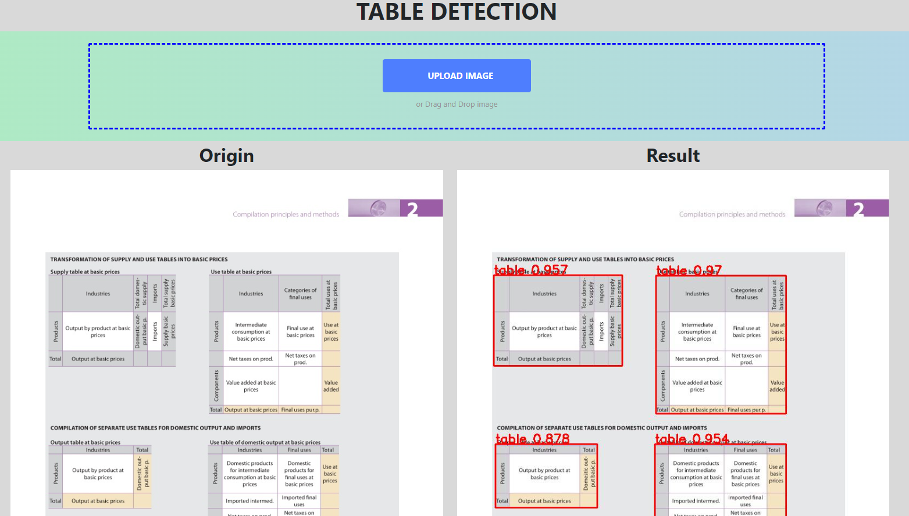

# Flask app detect table using ONNX model exported from YOLOv7

In this repository, I introduce how to convert from trained weight to onnx model and use it for my own custom app without depending on any module of Yolo.\

## Yolov7
To start, training in YOLOv7 is the first step. Follow: https://github.com/WongKinYiu/yolov7

## Dataset
ICDAR 2019: https://github.com/cndplab-founder/ICDAR2019_cTDaR

## Sample of inference
